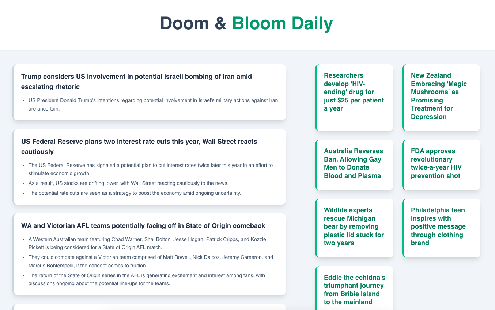

# Doom & Bloom Daily

> Your daily dose of reality and relief. Doom & Bloom Daily is a news aggregator that intelligently curates essential world news and genuinely uplifting stories to keep you informed without the burnout.

**[➡️ View Doom & Bloom Daily](https://news-ai-chi.vercel.app/)**

## About The Project

I was getting overwhelmed by negative headlines, but I still wanted to be informed.

Doom & Bloom Daily was created to solve this problem. It provides a balanced news diet by pairing serious, must-know headlines with a curated selection of positive and uplifting stories from around the web. The goal is to help users stay informed about the world while also being reminded of the good that happens every day.

## Key Features

- **Dual Feeds:** Seamlessly jump between "Doom" (serious news) and "Bloom" (uplifting news).
- **AI-Powered Curation:** Uses the OpenAI API to filter, select, and summarize the most relevant and genuinely positive stories, ensuring high-quality content with less click-baity headlines.
- **Daily Updates:** A Vercel cron job runs daily to fetch and process the latest news, ensuring the content is always fresh.
- **Performant Caching:** Leverages Vercel KV (serverless Redis) to store the daily news, providing incredibly fast load times for users.
- **Clean, Readable UI:** A minimalist interface designed for a pleasant reading experience.

## Tech Stack

- **Framework:** [Next.js](https://nextjs.org/) (App Router)
- **Styling:** [Tailwind CSS](https://tailwindcss.com/)
- **Deployment:** [Vercel](https://vercel.com/)
- **AI Curation:** [OpenAI API](https://openai.com/)
- **Database/Cache:** [Vercel KV](https://vercel.com/storage/kv) (Serverless Redis)
- **Scheduling:** Vercel Cron Jobs
